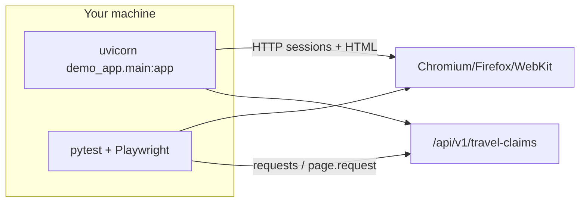

# TravelClaim QA Suite

**Repository:** [github.com/marslan54/travelclaim-qa-suite](https://github.com/marslan54/travelclaim-qa-suite)

Portfolio-style test automation for a **multi-language, multi-step travel compensation** flow (EU261-style claim reasons, corporate login, bilingual operations). The repo includes:

- A **local demo web app** (`demo_app/`) you run with Uvicorn—no external SaaS accounts.
- **Playwright + pytest** UI suites with **Page Object Models**, **markers**, and **Allure-ready** hooks.
- An **REST contract layer** (`tests/api/`) using **requests** and **Playwright’s `request` API**.
- **GitHub Actions** to run tests per browser (**Chromium, Firefox, WebKit**) and upload Allure artifacts.

---

## Installation guide

Follow these steps on a fresh machine (Windows PowerShell examples; adapt paths for macOS/Linux).

### 1. Prerequisites

| Requirement | Notes |
| --- | --- |
| **Python** | **3.10+** supported; **3.11+ or 3.12** recommended (CI uses **3.12**). Verify: `python --version` |
| **Git** | To clone this repository |

### 2. Clone and enter the project

```powershell
git clone https://github.com/marslan54/travelclaim-qa-suite.git
cd travelclaim-qa-suite
```

### 3. Virtual environment (recommended)

```powershell
python -m venv .venv
.\.venv\Scripts\Activate.ps1
python -m pip install --upgrade pip
```

On macOS/Linux:

```bash
python3 -m venv .venv
source .venv/bin/activate
pip install --upgrade pip
```

### 4. Install Python dependencies

From the repository root (the folder that contains `requirements.txt`, `demo_app/`, `tests/`):

```powershell
pip install -r requirements.txt
```

### 5. Install Playwright browser binaries

Browsers are **not** bundled in `requirements.txt`; install them separately:

```powershell
python -m playwright install chromium firefox webkit
```

For CI-style system deps on Linux only, `--with-deps` is used (see `.github/workflows/travelclaim-qa-ci.yml`). On Windows/Mac, the command above is usually enough.

---

## What this suite covers

| Layer | Folder | Scope |
| --- | --- | --- |
| **Smoke** | `tests/smoke/` | `/health`, login chrome, authenticated wizard shell |
| **UI functional** | `tests/ui/` | Happy-path submission, validation errors, bad login, locales (`en`/`de`/`fr`) |
| **UI edge** | `tests/ui/` | Unicode names, long strings within HTML limits, browser back/forward |
| **Regression** | `tests/regression/` | Alternate itinerary profile through confirmation |
| **API** | `tests/api/` | `POST /api/v1/travel-claims`: **201** + JSON schema; **422** validation; simulated **400/500** |

The demo app exposes:

- Multilingual routes: **`/{locale}/login`**, **`/{locale}/claim/step{1–3}`**, **`/{locale}/claim/confirmation`** with `locale ∈ { en, de, fr }`.
- REST: **`GET /health`**, **`GET /api/v1/config/locales`**, **`POST /api/v1/travel-claims`** (`201 Created` on success).

---

## How it works

1. **`demo_app/main.py`** hosts the portal and API. Sessions store wizard progress and login state server-side—realistic for “resume claim” QA.
2. **Tests** assume the portal is reachable at **`http://127.0.0.1:8765`** (see **`pytest.ini`** `base_url`, or override with **`TRAVELCLAIM_BASE_URL`** in `conftest.py`).
3. **`conftest.py`** runs **`verify_demo_portal`** once per session against **`GET /health`**. If the server is down, pytest exits with a clear instruction instead of long Playwright timeouts.
4. **`pages/`** centralize selectors (`data-testid`) and navigation; **`utils/test_data.py`** feeds realistic payloads.
5. **Playwright** drives browsers; **`pytest-base-url`** supplies the `base_url` fixture unless you redefine it—this project’s `base_url` prefers **`TRAVELCLAIM_BASE_URL`** when set.



---

## Running everything locally

You need **two terminals** (or one terminal for the server and one for tests).

### Terminal A — start the demo portal

```powershell
cd <path-to-repo>
.\.venv\Scripts\Activate.ps1   # if using a venv
python -m uvicorn demo_app.main:app --host 127.0.0.1 --port 8765
```

Wait until you see **“Uvicorn running on http://127.0.0.1:8765”**.

**Default login** (overridable with `TC_DEMO_EMAIL` / `TC_DEMO_PASSWORD`):

- Email: `claims.analyst@travelclaim.example`
- Password: `Eu261_R3gress!`

### Terminal B — run the full test pack

```powershell
cd <path-to-repo>
.\.venv\Scripts\Activate.ps1
python -m pytest tests --browser chromium -v
```

**Expected:** all tests **pass** (currently **21** UI + API cases for one browser run).

### Cross-browser (full matrix locally)

```powershell
python -m pytest tests `
  --browser chromium `
  --browser firefox `
  --browser webkit
```

### Optional: Allure raw results

```powershell
python -m pytest tests --browser chromium --alluredir=reports/allure/local-run
```

Serve with the Allure CLI: `allure serve reports/allure/local-run` (install [Allure](https://github.com/allure-framework/allure2) separately).

### Targeted runs

```powershell
python -m pytest tests/smoke --browser chromium
python -m pytest tests/ui --browser chromium
python -m pytest tests/api
python -m pytest -m smoke --browser chromium
```

---

## Configuration

| Variable | Purpose |
| --- | --- |
| **`TRAVELCLAIM_BASE_URL`** | Base URL for the demo app if not using `http://127.0.0.1:8765` |
| **`TC_DEMO_EMAIL`** / **`TC_DEMO_PASSWORD`** | Credentials the demo app expects for login |

---

## Troubleshooting

| Problem | What to do |
| --- | --- |
| **`TravelClaim demo portal not reachable`** (pytest exits immediately) | Start Uvicorn (Terminal A) or fix `TRAVELCLAIM_BASE_URL`. |
| **Port `8765` already in use (WinError 10048)** | Find the PID: `netstat -ano \| findstr :8765` → `Stop-Process -Id <PID> -Force`, or run Uvicorn on another port **and** set `TRAVELCLAIM_BASE_URL`. |
| **Playwright browser missing** | Run `python -m playwright install chromium` (add `firefox`, `webkit` as needed). |
| **`requests` dependency warning** (urllib3/chardet) | Harmless on many setups; pin compatible versions only if your org requires a clean warnings gate. |

---

## Project layout

```
demo_app/            # FastAPI multilingual UI + mocked REST submissions
fixtures/            # Shared auth/test user helpers
pages/               # Page Object Models (login, wizard steps, confirmation)
reports/allure/      # Git keeps .gitkeep; Allure results written at runtime
tests/
  api/               # REST contract + fault injection
  regression/        # Deeper journeys
  smoke/             # Fast checks
  ui/                # Functional, i18n, edge cases
utils/               # Test data factories
conftest.py          # Health gate + authenticated UI fixtures
pytest.ini           # discovery, markers, base_url default
requirements.txt     # pinned Python tooling
.github/workflows/   # CI: matrix browsers, Allure + JUnit artifacts
```

---

## CI/CD

`.github/workflows/travelclaim-qa-ci.yml` runs on **push to `main`**, installs deps and one Playwright browser per matrix job, starts **`uvicorn`**, runs **`pytest --alluredir=reports/allure/<browser>`**, and uploads Allure shards and JUnit XML.

---

## Tech choices (short)

| Choice | Why |
| --- | --- |
| **Playwright + pytest** | Industry-standard stack; solid waiting, traces, multi-browser. |
| **Page objects + `data-testid`** | Stable selectors without coupling to cosmetics. |
| **FastAPI demo** | Lightweight, typed API, multilingual templates—realistic QA target. |
| **Allure** | Rich stakeholder reports from the same pytest run. |

---

## Last verification run

Automated verification on this codebase: **`python -m pytest tests --browser chromium -v`** with the demo portal up — **21 passed**.

---

## Optional next steps for reviewers

- Attach **Playwright traces** (`PWDEBUG=1` / trace-on-failure hooks).
- Wire **HTML Allure Trend** storage in CI after the first nightly runs.
